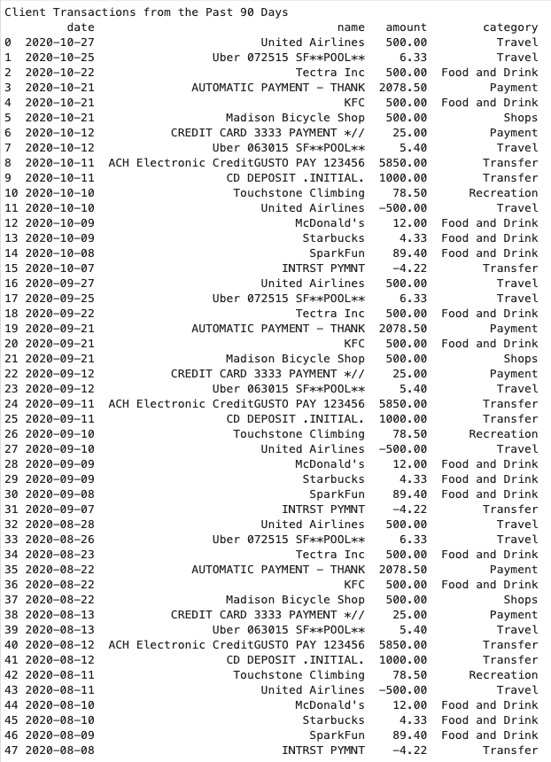
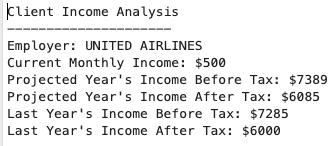
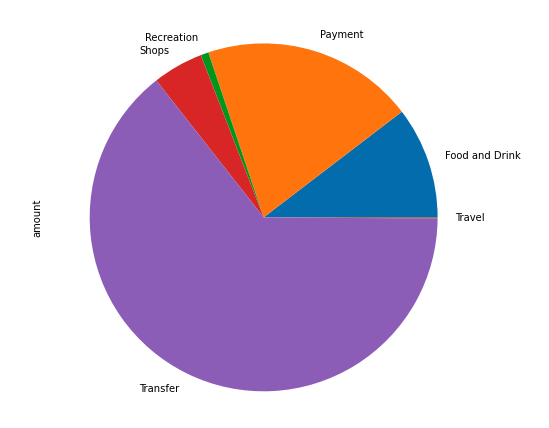
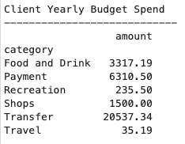
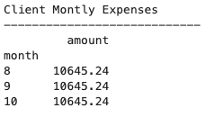

# API Homework 3 | How do you like them apps?

Harold's consumer division is now offering budgeting and financial planning to customers! There is now a report for customers that links to their banking and investment accounts and stays up to date automatically. 

## Account Summary 
Create a client to connect to Plaid and generate a public token. The public token created will then be exchanged for an access token to fetch accounts. the access token enables us to pull client data. 
Transaction data for the past 90 days: 

Income Analysis: 

Yearly Budget Spending:

Monthly Expenses:

